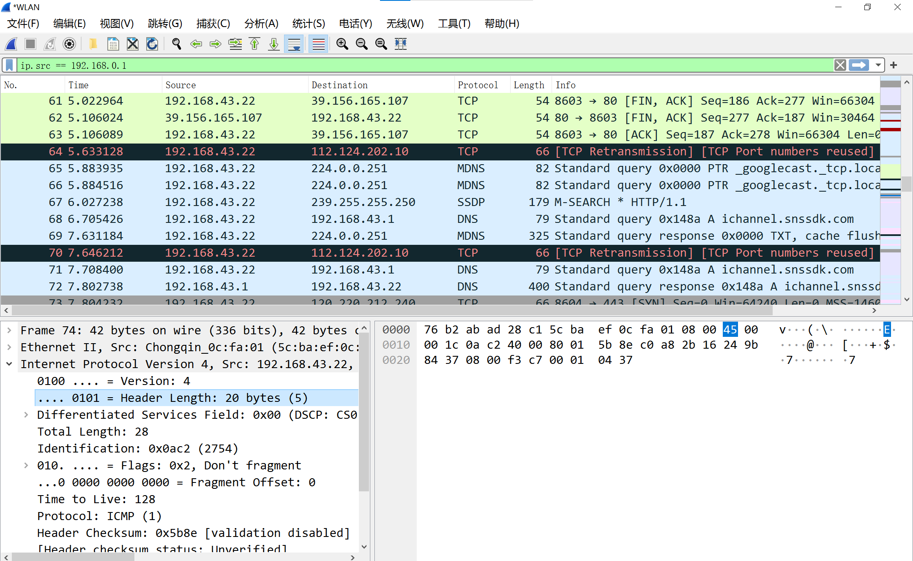
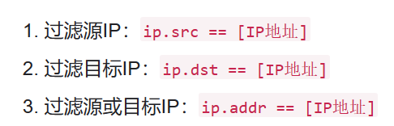
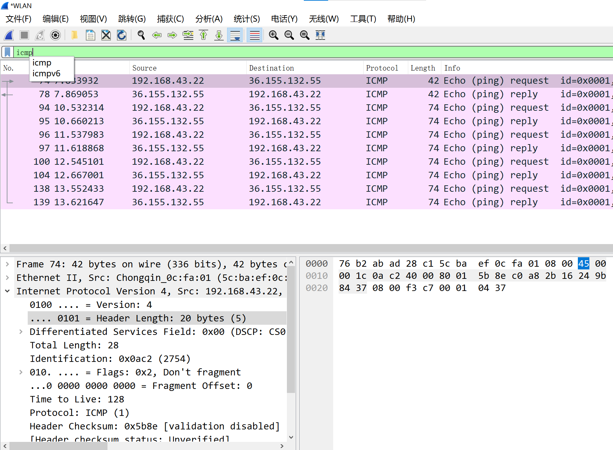

## 数据采集:实时捕捉 Ethernet 数据帧

## 解析 Ethernet 数据帧头部信息

## 实现基于 MAC 地址和头部类型字段的数据包过滤

+ `eth.addr == `

## 解析IP 数据包的头部信息;

## 实现基于IP 地址和IP 头协议的数据过滤;

## 对ICMP 报文要求至少解析ICMP 回显请求、回显应答、超时及目的地址不可达4 种消息报文。

+ 